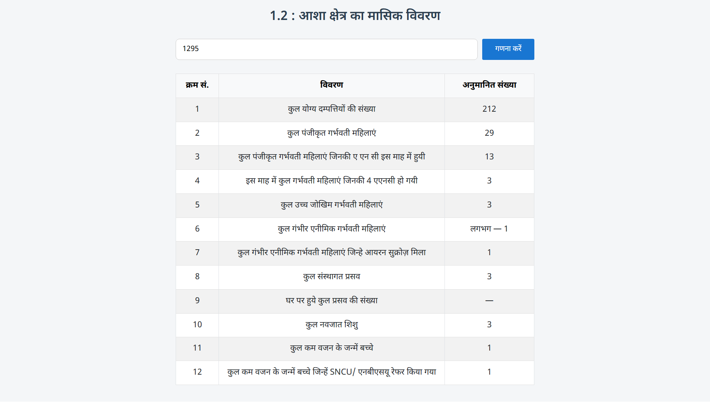

# आशा क्षेत्र का मासिक अनुमानित विवरण 🩺📊

यह एक सरल और उत्तरदायी (responsive) वेब टूल है जो **किसी दिए गए क्षेत्र की जनसंख्या** के आधार पर विभिन्न **मातृ एवं शिशु स्वास्थ्य संकेतकों (Health Indicators)** का अनुमानित मासिक विवरण तैयार करता है। इसका उपयोग मुख्यतः आशा (ASHA) कार्यकर्ताओं, स्वास्थ्य अधिकारियों और नीति निर्माताओं द्वारा किया जा सकता है।

## 🔧 विशेषताएँ (Features)

- हिंदी भाषा में इंटरफ़ेस 🇮🇳
- मोबाइल और डेस्कटॉप दोनों पर उत्तरदायी (Responsive Design)
- एक क्लिक में गणना
- **Bootstrap 5** और **Google Fonts (Devanagari)** का उपयोग
- सहज और आकर्षक UI

## 📦 लाइव डेमो

> आप इस टूल को [यहाँ लाइव](https://sudheerfy.github.io/Estimated-Monthly-Data-of-the-ASHA-Area) देख सकते हैं (लिंक बदलें अपने अनुसार)।

## 🖥️ स्क्रीनशॉट



## 📋 उपयोग कैसे करें (How to Use)

1. वेबसाइट को ओपन करें।
2. “**कुल जनसंख्या लिखें**” इनपुट बॉक्स में अपनी क्षेत्र की जनसंख्या दर्ज करें (उदाहरण: 230 से 10000 तक)।
3. "गणना करें" बटन पर क्लिक करें।
4. नीचे तालिका में अनुमानित डेटा देखिए।

## 💡 संकेतक जिनकी गणना होती है (Indicators Calculated)

- योग्य दंपत्तियों की संख्या
- पंजीकृत गर्भवती महिलाएं
- ANC (Ante Natal Checkups) की स्थिति
- उच्च जोखिम गर्भवती महिलाएं
- एनीमिक और आयरन सुक्रोज़ पाने वाली महिलाएं
- संस्थागत व घरेलू प्रसव
- नवजात शिशु और कम वजन के शिशु
- SNCU/NBSU रेफरल्स

## 🛠️ टेक्नोलॉजी

- HTML5
- CSS3
- JavaScript (Vanilla JS)
- Bootstrap 5
- Google Fonts – Noto Sans Devanagari

## 📁 प्रोजेक्ट संरचना (Project Structure)

```bash
  project/
    │
    ├── index.html
    ├── README.md 
    ├── screenshot.png
```

## ✅ भविष्य के सुधार (Future Enhancements)

- CSV या Excel में डाउनलोड की सुविधा
- अन्य भाषाओं में सपोर्ट (जैसे इंग्लिश)
- एपीआई इंटीग्रेशन

## 🤝 योगदान (Contribute)

अगर आप इस प्रोजेक्ट में योगदान देना चाहते हैं, तो कृपया:

1. इस रेपो को फोर्क करें।
2. एक नया ब्रांच बनाएँ (`feature/your-feature-name`)।
3. बदलाव करें और कमिट करें।
4. PR (Pull Request) सबमिट करें।

## 📜 लाइसेंस

यह प्रोजेक्ट MIT लाइसेंस के अंतर्गत आता है — आप इसे स्वतंत्र रूप से उपयोग और संशोधित कर सकते हैं।

---

**निर्माता:** *सुधीर सिंह / Unicef Gavi Zero Dose Program Adra India*

यदि आपको यह टूल उपयोगी लगा, तो इसे स्टार ⭐ जरूर करें!
